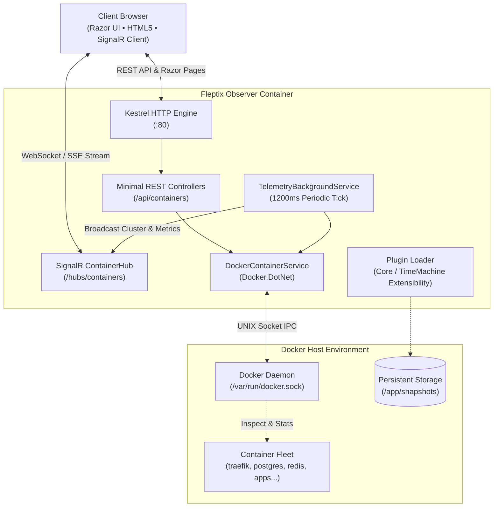

<div align="center">

<pre align="center">
  ███████╗██╗     ███████╗██████╗ ████████╗██╗██╗  ██╗
  ██╔════╝██║     ██╔════╝██╔══██╗╚══██╔══╝██║╚██╗██╔╝
  █████╗  ██║     █████╗  ██████╔╝   ██║   ██║ ╚███╔╝ 
  ██╔══╝  ██║     ██╔══╝  ██╔═══╝    ██║   ██║ ██╔██╗ 
  ██║     ███████╗███████╗██║        ██║   ██║██╔╝ ██╗
  ╚═╝     ╚══════╝╚══════╝╚═╝        ╚═╝   ╚═╝╚═╝  ╚═╝
</pre>

### Operational Container Telemetry & Fleet Management

[](https://github.com/Fleptor/Fleptix/pkgs/container/fleptix)
[](LICENSE)
[](https://dotnet.microsoft.com/)
[](https://github.com/Fleptor/Fleptix)
[](https://github.com/Fleptor/Fleptix)
[](https://github.com/Fleptor/Fleptix)

**Fleptix Observer** is a zero-overhead, high-density Docker observability engine and fleet manager designed for DevOps engineers, sysadmins, and homelab operators. It connects directly to your local or remote Docker daemon, streaming sub-second container metrics, live logs, in-browser exec terminals, and filesystem exploration through a single, dependency-free container.

[Quickstart](#-quickstart) • [Features](#-key-capabilities) • [Docker Compose](#-docker-compose) • [Observer vs Time Machine](#-observer-vs-time-machine) • [Configuration](#-configuration) • [Architecture](#-architecture) • [Building from Source](#-building-from-source)

</div>

---

## ⚡ Quickstart

Get Fleptix Observer running against your local Docker engine in under 5 seconds.

### Option A: One-Line Installer & Updater

Run the automated installer to pull the latest image, cleanly replace any running instances, and launch Fleptix Observer:

```bash
curl -sSL https://raw.githubusercontent.com/Fleptor/Fleptix/main/install.sh | bash
```

### Option B: Docker CLI (`docker run`)

```bash
# Stop and remove previous container instance (if any)
docker rm -f fleptix-observer 2>/dev/null || true

# Run Fleptix Observer
docker run -d \
  --name fleptix-observer \
  -p 7373:80 \
  -v /var/run/docker.sock:/var/run/docker.sock \
  -v fleptix-data:/app/snapshots \
  --restart unless-stopped \
  ghcr.io/fleptor/fleptix:latest
```

Open your browser and navigate to:
```
http://localhost:7373
```

---

## 🐳 Docker Compose

For persistent homelab stacks or production monitoring, include Fleptix Observer in your `compose.yaml`:

```yaml
services:
  fleptix-observer:
    image: ghcr.io/fleptor/fleptix:latest
    container_name: fleptix-observer
    restart: unless-stopped
    ports:
      - "7373:80"
    volumes:
      # Mount Docker socket for container discovery and metrics
      - /var/run/docker.sock:/var/run/docker.sock
      # Data volume for settings and optional Time Machine snapshot storage
      - fleptix-data:/app/snapshots
    environment:
      - ASPNETCORE_HTTP_PORTS=80
      # Optional: specify custom Docker daemon endpoint (defaults to unix:///var/run/docker.sock)
      # - DOCKER_HOST=unix:///var/run/docker.sock

volumes:
  fleptix-data:
    name: fleptix-data
```

Start the stack:
```bash
docker compose up -d
```

---

## 🎯 Key Capabilities

Fleptix Observer is engineered as a **dense operational data tool** rather than a bloated dashboard. Information density and rapid action take priority over whitespace.

| Capability | Technical Implementation | Operational Benefit |
| :--- | :--- | :--- |
| **Real-Time Fleet Telemetry** | 1.2s tick over ASP.NET Core SignalR WebSockets | Sub-second visibility into CPU %, memory consumption vs. limits, network RX/TX, and disk block I/O. |
| **Lifecycle Orchestration** | Non-blocking `Docker.DotNet` API integration | Inline Start, Stop, Restart, Pause, Unpause, and Force Kill buttons with instant feedback. |
| **Compose Stack Grouping** | Label-based heuristics (`com.docker.compose.project`) | Workloads automatically grouped into stacks (`core-infra`, `media-suite`, `observability`) with aggregated health. |
| **Smart Port Forward Links** | Host header detection and exposed port mapping | Clickable links dynamically resolve to host IP/domain with proper protocols (`http://` vs `https://`). |
| **Live Streaming Logs** | Tail stream buffer with color formatting | Real-time container log tailing (100–1000+ lines), auto-scroll lock, and diagnostic exit code tracking (e.g. Exit 137 OOM). |
| **In-Browser Container Exec** | Interactive terminal hooked into container stdin/stdout | Run diagnostic commands (`sh`, `bash`, `top`, `env`) directly inside containers without leaving the browser. |
| **Filesystem Inspector** | In-container tar stream directory reader | Browse container filesystems, view configuration files (`nginx.conf`, `.env`), and download runtime diagnostic artifacts. |
| **Container Deployer** | Template-driven deployment pipeline | Launch containers instantly with preconfigured templates (`nginx`, `redis`, `postgres`, `node`, `rabbitmq`, `prometheus`) or custom parameters. |
| **Engineered Dense UI** | Custom dark/light mode with typography scaling | High-information tables, monospace identifiers, configurable terminal colors, and zero framework bloat. |

---

## 📊 Observer vs. Time Machine

Fleptix follows an open-core model. **Fleptix Observer** is 100% free and open-source under the MIT license. **Fleptix Time Machine** is an optional modular commercial plugin for continuous state capture and deterministic crash rollback.

```
┌─────────────────────────────────────────────────────────────┐
│                      Fleptix Core                           │
├──────────────────────────────┬──────────────────────────────┤
│       Fleptix Observer       │     Fleptix Time Machine     │
│   (Open Source Community)    │    (Pro / Team Extension)    │
│                              │                              │
│ • Live Sub-Second Telemetry  │ • Continuous Delta Snapshots │
│ • Container Lifecycle (CRUD) │ • Minute-by-Minute Rewind    │
│ • Docker Compose Stacks      │ • Sandbox Crash Replay       │
│ • Real-time Logs & Exec      │ • Automated Root-Cause Dete- │
│ • In-Container File Browser  │   ction & Failure Forensics  │
│ • Clickable Port Forwarding  │ • Automated Volume Pruning   │
│                              │                              │
│         [MIT LICENSE]        │     [PERPETUAL LICENSE]      │
└──────────────────────────────┴──────────────────────────────┘
```

| Feature | Fleptix Observer (Community) | Fleptix Time Machine (Pro) |
| :--- | :---: | :---: |
| **License Model** | **Open Source (MIT)** | **Perpetual Commercial** |
| **Telemetry Streaming (CPU, RAM, Net, Disk)** | ✅ Live (1.2s tick) | ✅ Live (1.2s tick) |
| **Container Actions (Start / Stop / Restart / Kill)** | ✅ Full Control | ✅ Full Control |
| **Compose Stack Aggregation** | ✅ Included | ✅ Included |
| **Interactive In-Browser Exec** | ✅ Included | ✅ Included |
| **In-Container File Explorer & Downloader** | ✅ Included | ✅ Included |
| **Clickable Port Forwards** | ✅ Dynamic Host Resolution | ✅ Dynamic Host Resolution |
| **Continuous Container State Snapshots** | — | ✅ Sub-Second Deltas |
| **Historical Timeline State Rewind** | — | ✅ Minute-by-Minute Slider |
| **CrashLoop Fork & Sandbox Replay** | — | ✅ 1-Click Isolated Debug |
| **Automated Failure Forensics** | — | ✅ Heuristic Timeline Analysis |

---

## ⚙️ Configuration

Fleptix Observer is configured via environment variables or `appsettings.json`.

| Environment Variable | Default | Description |
| :--- | :--- | :--- |
| `ASPNETCORE_HTTP_PORTS` | `80` | Internal port the Observer web server binds to inside the container. |
| `DOCKER_HOST` | `unix:///var/run/docker.sock` | Docker daemon endpoint. Supports UNIX sockets, Windows named pipes (`npipe://./pipe/docker_engine`), or remote TCP endpoints (`tcp://192.168.1.50:2375`). |
| `FLEPTIX_PORT` | `7373` | Host port mapped by `install.sh` when launching the container. |
| `TimeMachine__Enabled` | `false` | Enables the commercial Time Machine snapshot plugin when a valid license key is present. |

### Connecting to a Remote Docker Daemon

To observe a remote Docker daemon without exposing the raw socket on the host network, specify `DOCKER_HOST`:

```bash
docker run -d \
  --name fleptix-observer \
  -p 7373:80 \
  -e DOCKER_HOST="tcp://192.168.1.100:2375" \
  --restart unless-stopped \
  ghcr.io/fleptor/fleptix:latest
```

---

## 🛡️ Security & Permissions

### Docker Daemon Socket Access
Fleptix Observer interacts with `/var/run/docker.sock` to collect metrics and dispatch container commands. Access to the Docker socket equates to root-level permissions on the Docker host.

- **Standard Deployment**: The official image executes with appropriate permissions to read and write to the mounted socket, identical to tools like Portainer, Watchtower, or Dozzle.
- **Dedicated User**: A dedicated non-root user `fleptix` (`UID 10001`, `GID 10001`) is baked into the Docker image. In hardened environments, pass your host's Docker group ID:

```bash
docker run -d \
  --name fleptix-observer \
  --user 10001 \
  --group-add $(getent group docker | cut -d: -f3) \
  -p 7373:80 \
  -v /var/run/docker.sock:/var/run/docker.sock \
  ghcr.io/fleptor/fleptix:latest
```

---

## 🏗️ Architecture

Fleptix Observer is built on modern .NET 10 unified runtime architecture:



### Component Breakdown
- **`Fleptix.Core`**: Shared domain abstractions, container metric records, and interfaces (`IContainerService`, `ISnapshotService`, `ILicenseService`).
- **`Fleptix.Observer`**: ASP.NET Core web host containing Razor Pages, SignalR Hubs, API Controllers, and background polling workers.
- **`Fleptix.TimeMachine`**: Modular state-capture engine compiled as a drop-in assembly for commercial snapshot features.

---

## 🛠️ Building from Source

### Prerequisites
- [.NET 10.0 SDK](https://dotnet.microsoft.com/download/dotnet/10.0)
- [Docker Engine](https://docs.docker.com/engine/install/) (version 24.0+)
- Git

### 1. Clone the Repository
```bash
git clone https://github.com/Fleptor/Fleptix.git
cd Fleptix
```

### 2. Run Locally via .NET CLI
Ensure your user account can communicate with `/var/run/docker.sock` (or Docker Desktop on Windows):

```bash
# Restore package dependencies across solution
dotnet restore

# Run Observer web application
dotnet run --project src/Fleptix.Observer
```

The application will bind to `http://localhost:5000` (or the ports indicated in your console output).

### 3. Build Container Image Locally
```bash
docker build -t fleptix:local -f Dockerfile .

docker run -d \
  --name fleptix-dev \
  -p 7373:80 \
  -v /var/run/docker.sock:/var/run/docker.sock \
  fleptix:local
```

---

## 🤝 Contributing

Contributions, bug reports, and suggestions are welcome!

1. **Fork the repository** on GitHub.
2. **Create a descriptive feature branch** (`git checkout -b feat/my-enhancement`).
3. **Commit your changes** following conventional commits (`git commit -m 'feat(telemetry): add disk I/O rate calculation'`).
4. **Push to your branch** (`git push origin feat/my-enhancement`).
5. **Open a Pull Request** against `main`.

Please ensure:
- Code adheres to existing C# / Razor conventions in the codebase.
- UI changes maintain dense information hierarchy and avoid unnecessary whitespace or marketing elements.

---

## 📄 License

Fleptix Observer is open-source software licensed under the **[MIT License](LICENSE)**.

---

<div align="center">
  <sub>Engineered for reliability by Fleptor.</sub>
</div>
